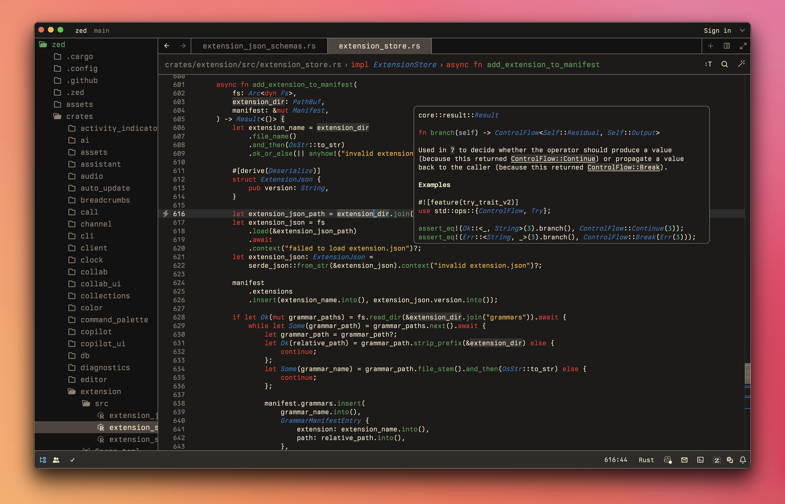

  

  
  

  

Srcery is a color scheme with clearly defined contrasting colors and a
slightly earthy tone.  This is a schema for the <a href="https://zed.dev/">Zed</a> code editor.

---

## Getting Started

To be added...

## Screenshot

## Attribution

Imported from [srcery-vscode](https://github.com/srcery-colors/srcery-vscode) with [Zed's theme importer](https://github.com/zed-industries/zed/tree/main/crates/theme_importer).  Big thanks to @gagbo for creating the VS Code theme.

## License

[MIT license](./LICENSE)
